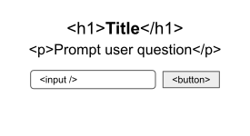
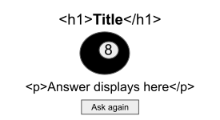

# Onboarding: Magic 8 Ball

## Project Planning

### on page load / reset:

### after button submit:

### HTML

`<header>`

-   `h1` for title

`<main>` > `<section id="prompt>`

-   `p` for prompt
-   text `input` to ask question
-   `button` to submit question (`#submit`)

`<main>` > `<section id="fotrune">`

-   `img` for 8 ball
-   `p` for answer (`#answer`)
-   `button` to ask again(`#reset`)

### Events

-   button click (submit question)
    -   initialize array of answers, pick random number, set as random answer variable
    -   hide prompt
    -   display image
    -   set content of answer `p` to the the random answer
-   button click (ask again)
    -   hide the 8 ball and answer
    -   show prompt

## Workflow

-   Plan project in README.md [complete]
-   Build HTML and center with CSS [complete]
-   Get DOM elements [complete]
-   Display random answer on submit button click [complete]
-   Implement show/hide logic [complete]
-   Remove console.log statements [complete]
-   Style input and buttons [complete]
-   Clear question from input on reset [complete]
-   Edit alt text to be more descriptive [complete]

_Look for green check after each commit!_

## Attributions

Clker-Free-Vector-Images [_Magic 8 Ball._](https://pixabay.com/vectors/ball-8-eight-flame-fire-pool-33995/) Pixabay.
